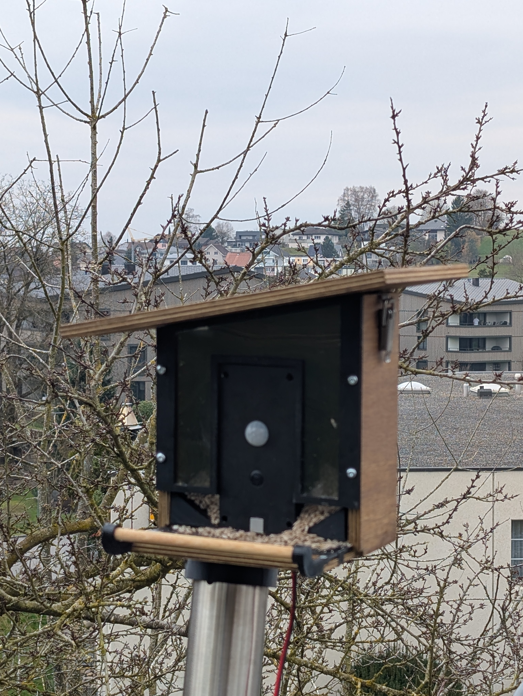

<p align="center">
  
</p>

<h1 align="center">Birdy - Smart Bird Feeder</h1>

<p align="center">
  <strong>AI-powered bird species identification on a Raspberry Pi 5</strong>
</p>

<p align="center">
  <a href="#features">Features</a> &bull;
  <a href="#hardware">Hardware</a> &bull;
  <a href="#architecture">Architecture</a> &bull;
  <a href="#installation">Installation</a> &bull;
  <a href="#configuration">Configuration</a> &bull;
  <a href="#home-assistant">Home Assistant</a>
</p>

---

Birdy turns a regular bird feeder into an intelligent monitoring station. A PIR sensor detects motion, triggers a camera recording, and a TensorFlow Lite model identifies the bird species in real time - all running locally on a Raspberry Pi 5 with no cloud dependency.

## Features

- **Real-time Bird Detection** - PIR motion sensor triggers 4-second video capture at 720p/15fps
- **ML Species Identification** - TensorFlow Lite classifier identifies bird species in ~50-100ms
- **Regional Species Filter** - Swiss Mittelland allowlist (151 species) prevents implausible detections like Cardinals or Cockatoos
- **Web Dashboard** - Responsive Django web app with live stats, photo gallery, and video playback
- **Home Assistant Integration** - MQTT auto-discovery for feed weight, species, and visit counters
- **Weight Monitoring** - HX711 load cell tracks food level with automatic drift compensation
- **PWA Support** - Install as a native app on your phone
- **USB Media Storage** - Photos and videos stored on external USB drive
- **Statistics** - Daily, monthly, and yearly visit tracking per species

## Hardware

| Component | Model | GPIO |
|---|---|---|
| Single Board Computer | Raspberry Pi 5 | - |
| Camera | Pi Camera Module | CSI |
| Motion Sensor | HC-SR501 PIR | GPIO 17 |
| Weight Sensor | HX711 + Load Cell | GPIO 5 (DT), GPIO 6 (SCK) |
| Storage | USB Drive mounted at `/mnt/birdy_storage` | USB |

## Architecture

```
PIR Trigger ──> Video Recording ──> Frame Extraction ──> ML Classification
   (GPIO 17)     (rpicam-vid)         (ffmpeg)           (TF Lite)
                                                             │
                    ┌────────────────────────────────────────┘
                    ▼
              ┌──────────┐     ┌──────────────┐     ┌─────────────┐
              │PostgreSQL │     │ MQTT Publish  │     │  Web Dashboard│
              │  Storage  │     │Home Assistant │     │  (Gunicorn)   │
              └──────────┘     └──────────────┘     └─────────────┘
```

### Tech Stack

| Layer | Technology |
|---|---|
| Web Framework | Django 5.0, Django REST Framework |
| Database | PostgreSQL 12 |
| Task Queue | Celery + Redis |
| ML Inference | TensorFlow Lite (iNaturalist bird model) |
| Video Encoding | H.264 via rpicam-vid |
| WSGI Server | Gunicorn |
| Home Automation | MQTT (paho-mqtt) |
| Camera | picamera2 |

## Installation

### Prerequisites

- Raspberry Pi 5 with Raspberry Pi OS (64-bit)
- Python 3.13+
- PostgreSQL, Redis
- Pi Camera Module, HC-SR501 PIR sensor, HX711 weight sensor

### Setup

```bash
# Clone the repository
git clone https://github.com/sz24sz24-5607/birdy-project.git
cd birdy-project

# Create virtual environment
python3 -m venv venv
source venv/bin/activate

# Install dependencies
pip install -r requirements.txt

# Configure environment
cp .env.example .env
# Edit .env with your credentials

# Setup database
python manage.py migrate
python manage.py createsuperuser

# Collect static files
python manage.py collectstatic

# Calibrate weight sensor
python manage.py calibrate_weight
```

### Running

**Development:**
```bash
./start_dev.sh
```

**Production (systemd):**
```bash
# Copy service files
sudo cp systemd/*.service /etc/systemd/system/
sudo systemctl daemon-reload

# Enable and start all services
sudo systemctl enable --now birdy-gunicorn
sudo systemctl enable --now birdy-celery-worker
sudo systemctl enable --now birdy-celery-beat
sudo systemctl enable --now birdy-detection
```

## Configuration

All settings are in `birdy_config/settings.py`. Key parameters:

```python
BIRDY_SETTINGS = {
    'CAMERA_RESOLUTION': (1280, 720),
    'CAMERA_FRAMERATE': 15,
    'RECORDING_DURATION_SECONDS': 4,
    'MIN_CONFIDENCE_THRESHOLD': 0.7,    # Display threshold
    'MIN_CONFIDENCE_SPECIES': 0.5,      # Valid visit threshold
}
```

Sensitive values (DB password, MQTT credentials, secret key) are loaded from `.env`.

## Home Assistant

Birdy publishes to MQTT with Home Assistant auto-discovery:

| Entity | Topic | Description |
|---|---|---|
| Feed Weight | `birdy/feed/weight` | Current food weight (grams) |
| Bird Detected | `birdy/bird/detected` | Binary motion sensor |
| Last Species | `birdy/bird/species` | Last identified species |
| Visits Today | `birdy/stats/today` | Daily visit counter |

## Detection Pipeline

1. PIR sensor triggers on motion
2. Camera records 4s video (H.264, 720p)
3. 8 frames extracted evenly across the video via ffmpeg (every ~0.5s)
4. TensorFlow Lite classifies each frame (~50-100ms per frame)
   - Only species from `ml_models/swiss_midland_allowlist.txt` are considered (151 Swiss Mittelland species)
   - The species with the highest score among allowed species wins per frame
5. Frame with highest non-background confidence is selected as the best frame
6. If no valid bird detected (confidence < 50% or all frames = background): video deleted, no DB entry
7. Results stored in PostgreSQL with best photo + video
8. MQTT notification sent to Home Assistant
9. Web dashboard updates automatically

### Regional Species Filter

The global iNaturalist model covers ~964 bird species worldwide. Without filtering, implausible
species were regularly detected (Northern Cardinal, Monk Parakeet, Galah, Kea, etc.).

The allowlist `ml_models/swiss_midland_allowlist.txt` restricts detections to **151 species**
plausible for the Swiss Mittelland — resident birds, common migrants, and waterbirds. The file
uses scientific names and can be freely extended. Restart `birdy-detection` after changes.

| Allowlist groups | Examples |
|---|---|
| Songbirds | Robin, Blackbird, Tits, Finches, Buntings, Sparrows |
| Swallows / Swifts | Barn Swallow, House Martin, Common Swift |
| Woodpeckers | Great Spotted, Green Woodpecker |
| Pigeons | Wood Pigeon, Collared Dove |
| Owls | Barn Owl, Little Owl, Long-eared Owl |
| Raptors | Buzzard, Kestrel, Sparrowhawk, Red Kite |
| Corvids | Magpie, Jay, Jackdaw, Rook, Raven |
| Waterbirds | Mallard, Coot, Grey Heron, Cormorant |
| Swans & Geese | Mute Swan, Greylag Goose, Egyptian Goose |

## Mechanical Construction

The birdhouse enclosure is a hybrid construction with 3D-printed and CNC-milled parts. All source files and manufacturing data are in the `mechanic/` folder.

<p align="center">
  
</p>

### 3D-Printed Parts (FDM)

| File | Description |
|---|---|
| `box_top.stl` / `box_bottom.stl` | Electronics enclosure (Raspberry Pi, camera) |
| `feeder_plate.stl` | Seed tray |
| `frame_left.stl` / `frame_right.stl` | Side frames |
| `bar_left.stl` / `bar_right.stl` | Mounting bars |
| `pole_mount.stl` / `pole_mount_2.stl` | Pole/post mounting bracket |
| `weight_main.stl` / `weight_left.stl` / `weight_right.stl` | Weight sensor housing |
| `konstruktion.skp` | SketchUp source file (full assembly) |

### CNC-Milled Parts (Wood) – `mechanic/mill/`

| File | Description |
|---|---|
| `back.stl` / `base.stl` / `left.stl` / `right.stl` | Wooden wall panels |
| `roof.stl` / `window.stl` | Roof and window panel |
| `*.E12` | Estlcam CNC project files |
| `m_*.gcode` | G-code toolpaths for CNC mill |

## Project Structure

```
birdy_project/
├── birdy_config/        # Django project settings & main views
├── sensors/             # Sensor models & management commands
├── species/             # Bird species models & statistics
├── media_manager/       # Photo & video models
├── homeassistant/       # MQTT client & HA integration
├── api/                 # REST API (DRF)
├── hardware/            # Camera, PIR, weight sensor drivers
├── services/            # Bird detection service
├── ml_models/           # TFLite model & label files
├── templates/           # Django HTML templates
├── static/              # CSS, icons, PWA manifest
├── systemd/             # Service files for production
└── mechanic/            # Birdhouse construction files (STL, SketchUp, G-code)
    └── mill/            # CNC milling files (Estlcam, G-code)
```

## License

This project is open source. Feel free to build your own smart bird feeder!
